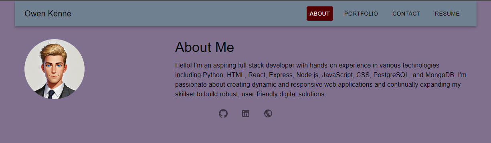
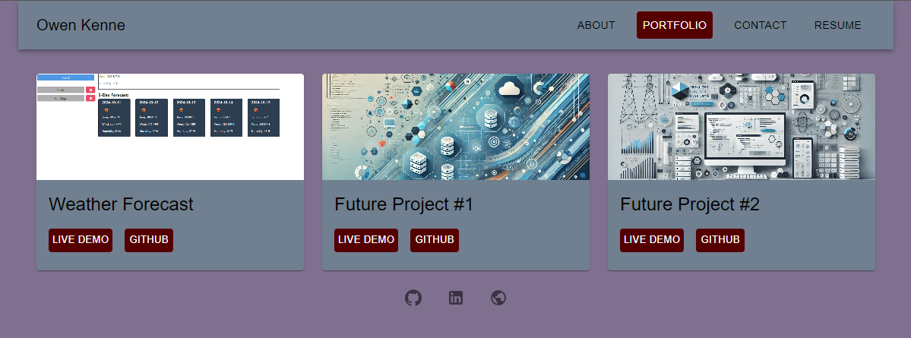
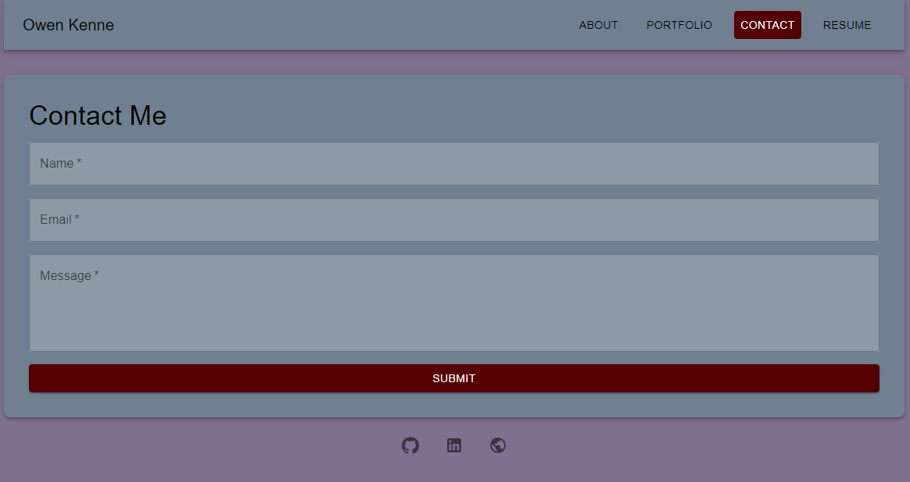
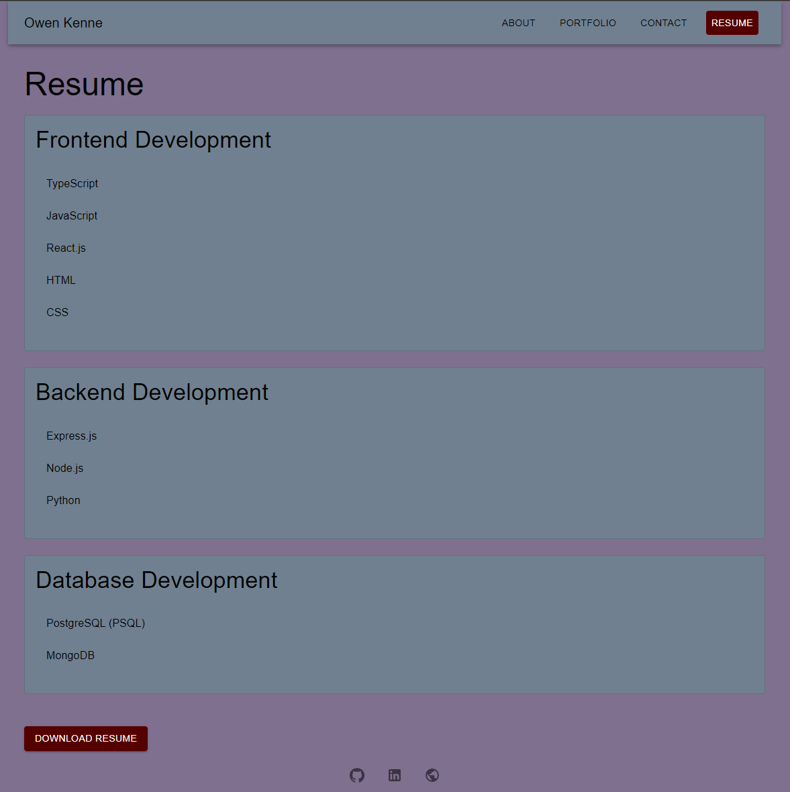

# Portfolio Development Playground

## Description
The Portfolio Development Playground is a single-page application designed for me to showcase my skills, experience, and projects. This app serves as a personal portfolio where visitors can view information about the me, including an about section, portfolio, resume, and contact form.

The application uses modern technologies like React, React Router, and Material UI to deliver a smooth and interactive user experience. It follows a component-based architecture, featuring reusable components such as Header, Footer, and Navigation. It also showcases different sections for a portfolio, such as About Me, Projects, Contact, and Resume.

The app is deployed on Netlify, offering seamless access to users on the web.

## Table of Contents
- [Installation](#installation)
- [Features](#features)
- [Usage](#usage)
- [Deployment](#deployment)
- [License](#license)
- [Contact Information](#contact-information)

## Installation
To run this project locally:

1. Clone the repository:
    ```bash
    git clone https://github.com/O-KenneDevWorks/portfolio-development-playground.git
    ```
2. Navigate to the project directory:
    ```bash
    cd portfolio-development-playground
    ```
3. Install dependencies:
    ```bash
    npm install
    ```

4. Start the development server:
    ```bash
    npm run dev
    ```

## Features
- **Responsive Design**: The app is built using Material UI, ensuring a responsive and mobile-friendly interface.
- **React Router**: Smooth transitions between different sections like About Me, Portfolio, Contact, and Resume.
- **Form Validation**: Contact form validates user input, ensuring all fields are filled, and the email format is correct.
- **Dynamic Portfolio**: Reusable Project component for showcasing different projects dynamically.
- **Theme Customization**: Custom theme with primary and secondary colors for a unique visual experience.
  
## Usage
Once the application is running, users can navigate between different sections through the navigation bar. They can explore the following sections:

- **About Me**: Learn about the developer, view a profile image, and read a short bio.
- **Portfolio**: Check out the developer’s past and future projects with links to both live apps and GitHub repositories.
- **Contact**: Fill out a contact form with validations to send a message to the developer.
- **Resume**: View the developer's resume and download a copy.

## Screenshots

### About Me Section


### Portfolio Section


### Contact Form


### Resume Section


## Deployment
The project is deployed on Netlify and can be accessed online:

[Portfolio Development Playground](https://astounding-rolypoly-ac3243.netlify.app/)

## License
This project is licensed under the MIT License.

## Contact Information
For any inquiries or collaborations, please reach out to:

**Owen Kenne**  
GitHub: [O-KenneDevWorks](https://github.com/O-KenneDevWorks)  
Email: okenne.devworks@gmail.com
